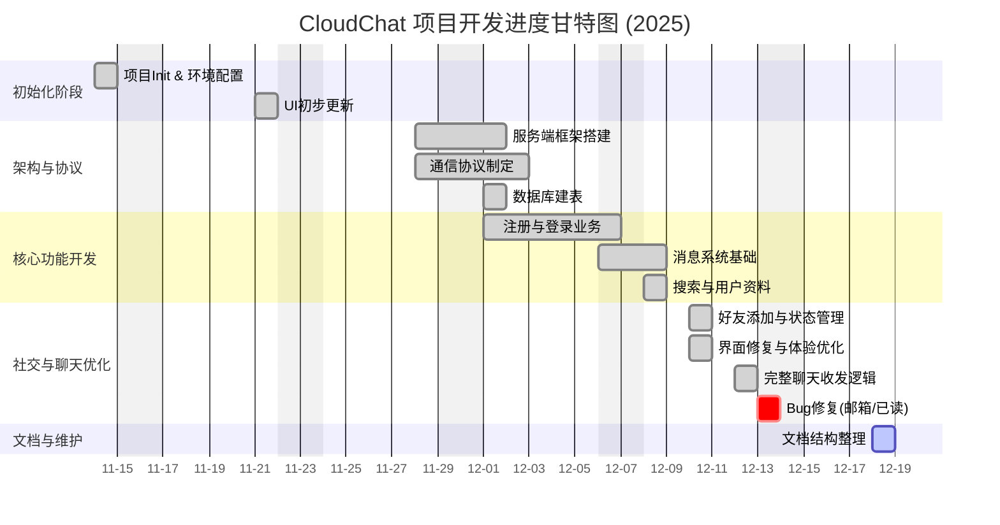

# 项目说明

仓库地址：https://github.com/Homat3/CloudChat

# 项目进度

本项目从2025年11月14日开始，预计于2025年12月16日完成所有任务。

## 进度表
---

### 1. 项目进度表

| 阶段 | 时间周期 | 任务模块 | 详细内容与里程碑 | 主要负责人 | 状态 |
| :--- | :--- | :--- | :--- | :--- | :--- |
| **P1** | 11.14 - 11.15 | **项目初始化** | • 初始化 Web 端架构 • 清理默认文件与环境配置 • 编写 README 文档 | Infinomat | ✅ 完成 |
| **P2** | 11.21 - 11.28 | **框架与协议设计** | • 搭建服务端初始化框架（DB、User类） • 制定初步通信协议 • 搭建服务端消息接收框架 | PeterWinchester Infinomat | ✅ 完成 |
| **P3** | 12.01 - 12.05 | **数据库与认证系统** | • 建立数据库表（Users, Friends, Messages） • 实现注册、登录（含 Token 登录） • 客户端登录模块 UI 与逻辑 | PeterWinchester quenquenwhynot Infinomat | ✅ 完成 |
| **P4** | 12.06 - 12.08 | **基础消息与搜索** | • 消息系统基础框架完成 • 全局联系人搜索与监听 • 用户信息与头像显示 | Infinomat Jsion-908 PeterWinchester | ✅ 完成 |
| **P5** | 12.10 - 12.11 | **社交关系链管理** | • 好友添加功能（请求收发、状态维护） • 联系人列表优化（在线状态、自动刷新） • 个人资料修改与头像更新机制 | PeterWinchester Infinomat | ✅ 完成 |
| **P6** | 12.12 - 12.13 | **核心聊天业务** | • 聊天消息收发完整逻辑闭环 • 消息已读标记修复 • 邮箱验证修复 | Infinomat PeterWinchester | ✅ 完成 |
| **P7** | 12.18 | **文档与收尾** | • 文档结构整理 • 阶段性代码合并 | Infinomat | ✅ 完成 |

---

### 2. 项目进度甘特图 (Mermaid)

