项目跨度为 **2025年11月14日 至 2025年12月18日**，主要集中在 **Web/客户端** 与 **Server/服务端** 的即时通讯功能开发。

---

# 1. 项目进度表

| 阶段 | 时间周期 | 任务模块 | 详细内容与里程碑 | 主要负责人 | 状态 |
| :--- | :--- | :--- | :--- | :--- | :--- |
| **P1** | 11.14 - 11.15 | **项目初始化** | • 初始化 Web 端架构<br>• 清理默认文件与环境配置<br>• 编写 README 文档 | Infinomat | ✅ 完成 |
| **P2** | 11.21 - 11.28 | **框架与协议设计** | • 搭建服务端初始化框架（DB、User类）<br>• 制定初步通信协议<br>• 搭建服务端消息接收框架 | PeterWinchester<br>Infinomat | ✅ 完成 |
| **P3** | 12.01 - 12.05 | **数据库与认证系统** | • 建立数据库表（Users, Friends, Messages）<br>• 实现注册、登录（含 Token 登录）<br>• 客户端登录模块 UI 与逻辑 | PeterWinchester<br>quenquenwhynot<br>Infinomat | ✅ 完成 |
| **P4** | 12.06 - 12.08 | **基础消息与搜索** | • 消息系统基础框架完成<br>• 全局联系人搜索与监听<br>• 用户信息与头像显示 | Infinomat<br>Jsion-908<br>PeterWinchester | ✅ 完成 |
| **P5** | 12.10 - 12.11 | **社交关系链管理** | • 好友添加功能（请求收发、状态维护）<br>• 联系人列表优化（在线状态、自动刷新）<br>• 个人资料修改与头像更新机制 | PeterWinchester<br>Infinomat | ✅ 完成 |
| **P6** | 12.12 - 12.13 | **核心聊天业务** | • 聊天消息收发完整逻辑闭环<br>• 消息已读标记修复<br>• 邮箱验证修复 | Infinomat<br>PeterWinchester | ✅ 完成 |
| **P7** | 12.18 | **文档与收尾** | • 文档结构整理<br>• 阶段性代码合并 | Infinomat | ✅ 完成 |

---

# 2. 项目进度甘特图 (Mermaid)

```mermaid
gantt
    title CloudChat 项目开发进度甘特图 (2025)
    dateFormat  YYYY-MM-DD
    axisFormat  %m-%d
    excludes    weekends

    section 初始化阶段
    项目Init & 环境配置       :done, init, 2025-11-14, 2025-11-15
    UI初步更新               :done, ui1, 2025-11-21, 1d

    section 架构与协议
    服务端框架搭建           :done, server1, 2025-11-28, 2d
    通信协议制定             :done, proto, 2025-11-28, 2025-12-03
    数据库建表               :done, db, 2025-12-01, 1d

    section 核心功能开发
    注册与登录业务           :done, auth, 2025-12-01, 2025-12-07
    消息系统基础             :done, msg_base, 2025-12-06, 2d
    搜索与用户资料           :done, user_info, 2025-12-08, 2025-12-09

    section 社交与聊天优化
    好友添加与状态管理       :done, friends, 2025-12-10, 2025-12-11
    界面修复与体验优化       :done, ui_fix, 2025-12-10, 2025-12-11
    完整聊天收发逻辑         :done, chat_full, 2025-12-12, 2025-12-13
    Bug修复(邮箱/已读)       :crit, bugfix, 2025-12-13, 1d

    section 文档与维护
    文档结构整理             :active, docs, 2025-12-18, 1d
```

# 4.整体架构图
```mermaid
graph TD
    %% 定义节点样式（移除末尾分号以提高兼容性）
    classDef client fill:#e1f5fe,stroke:#01579b,stroke-width:2px
    classDef nginx fill:#f3e5f5,stroke:#4a148c,stroke-width:2px
    classDef cpp fill:#e8f5e9,stroke:#1b5e20,stroke-width:2px
    classDef db fill:#fff3e0,stroke:#e65100,stroke-width:2px

    %% 节点定义：注意文本都加上了双引号
    Client["客户端 (浏览器)"]:::client
    Nginx["Nginx 反向代理 / 静态资源"]:::nginx
    Database[("MySQL 数据库<br/>主从复制")]:::db

    %% 后端服务子图
    subgraph Backend_Service ["后端服务 (C++)"]
        direction TB
        AccessLayer["<b>接入层</b><br/>WebSocket服务<br/>处理连接建立 / 心跳检测"]:::cpp
        
        subgraph BusinessLayer ["业务层"]
            direction TB
            UserMod["用户模块<br/>登录/注册/Token"]:::cpp
            ChatMod["聊天模块<br/>消息转发/存储"]:::cpp
            FileMod["文件模块<br/>分片上传/下载"]:::cpp
            VideoMod["视频模块<br/>WebRTC信令转发"]:::cpp
        end
        
        DataLayer["<b>数据层</b><br/>MySQL客户端<br/>数据读写 / 事务处理"]:::cpp
    end

    %% 连接关系
    Client <==> Nginx
    Nginx <==> AccessLayer
    AccessLayer <==> BusinessLayer
    BusinessLayer <==> DataLayer
    DataLayer <==> Database
```

# 5.数据交互时序图

```mermaid
sequenceDiagram
    participant C as 前端 (Client)
    participant A as 接入层 (Access)
    participant B as 业务层 (Business)
    participant D as 数据层 (Data)
    participant SQL as MySQL数据库

    Note over C, SQL: 场景示例：用户发送聊天消息 (WebSocket)

    C->>A: 1. 发送消息请求 (WebSocket)
    activate A
    A->>A: 解析请求类型
    A->>B: 2. 转发至聊天模块
    activate B
    
    Note right of B: 处理业务逻辑
    
    B->>D: 3. 请求写入消息记录
    activate D
    D->>SQL: 执行 Insert SQL
    activate SQL
    SQL-->>D: 返回执行结果
    deactivate SQL
    D-->>B: 返回成功状态
    deactivate D

    B-->>A: 4. 业务处理完成
    deactivate B

    A-->>C: 5. 返回确认 / 推送消息
    deactivate A
```

# 6. 系统核心业务全链路时序图

```mermaid
sequenceDiagram
    autonumber
    actor User as 用户
    participant Browser as 前端 (Angular)
    participant Nginx as Nginx (静态资源)
    participant Server as 后端服务
    participant DB as 数据库

    %% 阶段1：初始化
    Note over User, DB: 1. 初始化阶段
    User->>Browser: 打开浏览器访问地址
    Browser->>Nginx: 请求静态资源 (HTML/JS/CSS)
    Nginx-->>Browser: 返回 Angular 应用资源
    Browser->>Browser: 应用加载初始化

    %% 阶段2：登录认证
    Note over User, DB: 2. 登录与连接建立
    User->>Browser: 输入账号密码点击登录
    Browser->>Server: [HTTP] 发送登录信息
    activate Server
    Server->>DB: 验证用户信息
    DB-->>Server: 验证通过
    Server-->>Browser: 返回登录成功 & JWT Token
    deactivate Server
    
    Browser->>Server: [WebSocket] 携带 Token 建立连接
    activate Server
    Server->>Server: 验证 Token 有效性
    Server->>Server: 维护用户连接状态 (Online)
    Server-->>Browser: 连接建立成功
    deactivate Server

    %% 阶段3：消息通信
    Note over User, DB: 3. 聊天消息交互
    User->>Browser: 发送聊天消息
    Browser->>Server: [WebSocket] 发送消息数据
    activate Server
    Server->>Server: 解析消息类型 & 确定接收方
    par 并行处理
        Server->>DB: 存储消息记录
        Server->>Browser: 转发消息给接收方
    end
    deactivate Server

    %% 阶段4：视频通话
    Note over User, DB: 4. 视频通话 (WebRTC)
    User->>Browser: 发起视频通话
    Browser->>Server: [WebSocket] 发送 SDP Offer
    Server->>Browser: 转发信令给对端
    Browser->>Server: [WebSocket] 发送 SDP Answer / ICE Candidate
    Server->>Browser: 转发应答信令
    Note right of Browser: 双方根据信令建立 P2P 连接
    Browser->>Browser: P2P 视频流传输 (直接通信/不经后端)

    %% 阶段5：退出
    Note over User, DB: 5. 用户退出
    User->>Browser: 关闭页面或点击退出
    Browser->>Server: [WebSocket] 关闭连接
    Server->>Server: 清除连接状态
    Server->>DB: 更新为“离线”状态
```

# 7. 异常处理与心跳检测流程图

```mermaid
graph TD
    %% 样式定义
    classDef client fill:#e3f2fd,stroke:#1565c0,stroke-width:2px;
    classDef server fill:#f3e5f5,stroke:#4a148c,stroke-width:2px;
    classDef error fill:#ffebee,stroke:#c62828,stroke-width:2px;

    subgraph Client_Side ["前端逻辑 (客户端)"]
        direction TB
        Start((WebSocket<br>连接断开)):::client --> RetryInit[初始化重试计数器<br>Count = 0]:::client
        RetryInit --> CheckCount{Count < 3 ?}:::client
        
        CheckCount -- 是 --> Wait[等待 5 秒]:::client
        Wait --> DoRetry[尝试重新连接]:::client
        DoRetry --> IsSuccess{连接成功?}:::client
        
        IsSuccess -- 是 --> Reset[重置计数器<br>恢复正常通信]:::client
        IsSuccess -- 否 --> IncCount[Count + 1]:::client
        IncCount --> CheckCount
        
        CheckCount -- 否 --> ShowError("提示用户:<br>网络异常，请刷新页面"):::error
    end

    subgraph Server_Side ["后端逻辑 (服务端)"]
        direction TB
        Listen[监听连接状态]:::server --> Heartbeat{检测心跳包}:::server
        
        Heartbeat -- 收到心跳 --> ResetTimer[重置超时计时器]:::server
        ResetTimer --> Listen
        
        Heartbeat -- 未收到 --> CheckTime{无心跳时长<br>> 1分钟 ?}:::server
        CheckTime -- 否 --> Listen
        CheckTime -- 是 --> CleanConn[自动断开 Socket 连接]:::server
        CleanConn --> MarkOffline[标记数据库状态:<br>用户离线]:::server
    end
```

 # 8. 前端与后端层次结构
 ## 前端架构图
```mermaid
flowchart TB
    %% === 样式定义 ===
    classDef main fill:#e3f2fd,stroke:#1565c0,stroke-width:2px;
    classDef view fill:#fff3e0,stroke:#f57c00,stroke-width:2px;
    classDef component fill:#ffffff,stroke:#555,stroke-width:1px,stroke-dasharray: 5 5;
    classDef core fill:#e8f5e9,stroke:#2e7d32,stroke-width:2px;

    %% === 1. 应用入口与路由 ===
    subgraph APP_BOOTSTRAP ["🚀 Bootstrap Routing"]
        direction TB
        AppModule("AppModule (Root)"):::main
        AppRouting("AppRoutingModule"):::main
        AuthGuard("AuthGuard"):::main
        
        AppModule --> AppRouting
        AppRouting --> AuthGuard
    end

    %% === 2. 视图层 (Pages & Layouts) ===
    subgraph VIEW_LAYER ["🖥️ View Layer (Pages & Components)"]
        direction LR

        %% 左侧：认证相关
        subgraph AUTH_PAGES ["Authentication"]
            direction TB
            Login["Login Page"]:::view
            Register["Register Page"]:::view
            Login -.-> Register
        end

        %% 右侧：主业务相关
        subgraph MAIN_PAGES ["Main Application"]
            direction TB
            ChatLayout["Chat Layout (Container)"]:::view
            Settings["Settings Page"]:::view
            
            %% 内部组件详情
            subgraph CHAT_COMPONENTS ["Layout Components"]
                direction TB
                Sidebar["Sidebar Component"]:::component
                ChatArea["Chat Area Component"]:::component
                ContactList["Contact List"]:::component
                AddContact["Add Contact Dialog"]:::component
            end
            
            ChatLayout --> Sidebar & ChatArea
            Sidebar --> ContactList & AddContact
        end

        %% 路由指向
        AuthGuard -- "Authorized" --> ChatLayout
        AuthGuard -- "Unauthorized" --> Login
    end

    %% === 3. 核心服务与数据层 ===
    subgraph CORE_LAYER ["⚙️ Core Layer (Services & Data)"]
        direction LR
        
        subgraph NETWORK ["Network & API"]
            direction TB
            SocketSvc["SocketService (WebSocket)"]:::core
            ReqSvc["RequestService (HTTP)"]:::core
        end

        subgraph STATE ["State & Logic"]
            direction TB
            AuthSvc["AuthService"]:::core
            MsgSvc["MessageService"]:::core
            ContactSvc["ContactService"]:::core
        end

        subgraph DATA ["Models & Protobuf"]
            direction TB
            Models["Data Models (User/Msg)"]:::core
            Protos["Proto Definitions"]:::core
        end

        %% 依赖关系
        NETWORK --> STATE
        STATE --> DATA
    end

    %% === 层级连接 ===
    VIEW_LAYER ==> STATE
    VIEW_LAYER -.-> Models
```
## 后端架构图


# 9.项目模块结构
## 前端 UI 与路由结构

## 前端核心逻辑架构

## 后端服务端核心

## 后端业务与数据模块

# 10.模块详细功能
## 客户端
### AppModule
```mermaid
flowchart LR
  subgraph 根模块 AppModule
    in[输入: 启动参数 / 环境配置 / 路由定义] --> proc(处理: 初始化应用、注册路由、注入服务)
    proc --> out[输出: 根组件实例 / 路由表 / 服务单例]
  end
```
### 页面与布局
```mermaid
flowchart LR
  subgraph 页面与布局
    in[输入: 用户交互 / 路由导航 / API 数据] --> proc(处理: 渲染视图、表单验证、事件传播)
    proc --> out[输出: UI 更新 / 用户操作事件 / 请求调用]
  end
```
### SocketService
```mermaid
flowchart LR
  subgraph SocketService
    in[输入: 服务器 WS 消息 / 客户端消息请求] --> proc(处理: 建连、编码/解码、心跳、重连)
    proc --> out[输出: 事件回调 / 转发给 MessageService 或其他服务]
  end
```
### RequestService
```mermaid
flowchart LR
  subgraph RequestService
    in[输入: 前端 HTTP 请求] --> proc(处理: 发起 REST/HTTP、处理响应、错误重试)
    proc --> out[输出: API 响应 / 错误信息]
  end
```
### AuthService
```mermaid
flowchart LR
  subgraph AuthService
    in[输入: 凭证 / Token / 登录请求] --> proc(处理: 验证凭证、保存 token、用户状态管理)
    proc --> out[输出: 登录结果 / 用户会话状态 / Token]
  end
```
### MessageService
```mermaid
flowchart LR
  subgraph MessageService
    in[输入: 用户发送消息 / 接收服务器消息] --> proc(处理: 排队、格式化、持久化请求、更新本地状态)
    proc --> out[输出: 发往 Socket / 更新 UI / 本地消息记录]
  end
```
### ContactService
```mermaid
flowchart LR
  subgraph ContactService
    in[输入: 加载联系人请求 / 添加/删除联系人命令] --> proc(处理: 调用 API、更新本地联系人列表)
    proc --> out[输出: 联系人列表 / 操作结果 / 通知 UI]
  end
```
### Models & Protocols
```mermaid
flowchart LR
  subgraph Models & Protocols
    in[输入: 原始 JSON / 表单数据 / 二进制] --> proc(处理: 序列化/反序列化、类型校验、转换为内部模型)
    proc --> out[输出: User/Message/FriendRequest 对象 / 协议消息 payload]
  end
```
## 服务端
### main/事件回路
```mermaid
flowchart LR
  subgraph main/事件回路
    in[输入: 启动配置 / 网络连接请求] --> proc(处理: 启动服务、监听 WS、注册信号处理)
    proc --> out[输出: 可用 WS 服务器 / 事件循环]
  end
```
### OnMessage -> Dispatcher
```mermaid
flowchart LR
  subgraph OnMessage - Dispatcher
    in[输入: WS 消息 JSON/Protocol] --> proc(处理: 解析消息、路由到 CloudChatService 的相应处理函数)
    proc --> out[输出: 响应消息 / 广播通知 / DB 操作请求]
  end
```
### Service - Auth
```mermaid
flowchart LR
  subgraph Service - Auth
    in[输入: 登录/注册/Token] --> proc(处理: 校验、DB 查询/写入、生成 token、维护在线映射)
    proc --> out[输出: 验证结果 / 用户信息 / Token / 推送通知]
  end
```
### Service - Contacts/Message
```mermaid
flowchart LR
  subgraph Service - Contacts/Message
    in[输入: 加载联系人 / 发送消息 / 文件/图片] --> proc(处理: DB 操作、消息持久化、路由/推送到在线用户)
    proc --> out[输出: 联系人数据 / 发送确认 / 即时推送]
  end
```
### CloudChatDat (DB 访问)
```mermaid
flowchart LR
  subgraph CloudChatDat DB 访问
    in[输入: SQL 请求 / 查询参数] --> proc(处理: 构造查询、执行、结果映射)
    proc --> out[输出: 记录集 / 受影响行数 / 错误码]
  end
```

# 11.模块详细分析图
## 登录模块
### 程序流程图
```mermaid
flowchart TD
  Start([开始])
  A[接收凭证 username,password]
  B{输入合法?}
  C[查询用户记录 DB]
  D{用户存在?}
  E{账户激活?}
  F{密码匹配?}
  G[生成 token, 更新在线映射]
  H[返回成功响应 user, token]
  I[返回失败响应 错误消息]
  End([结束])

  Start --> A --> B
  B -- 否 --> I
  B -- 是 --> C --> D
  D -- 否 --> I
  D -- 是 --> E
  E -- 否 --> I
  E -- 是 --> F
  F -- 否 --> I
  F -- 是 --> G --> H --> End
```
### 判定表（核心判定）
|条件编号   |用户存在|账户激活|密码匹配|结果                    |
| :---      | :---  | :---  | :---  | :---                      |
|C1         |否     |—      |—      |返回 "user not found"  |		 
|C2         |是     |否     |	—   |返回 "account inactive"    |
|C3         |是	    |是	    |否	    |返回 "invalid credential"  |
|C4	        |是	    |是	    |是	    |生成 token，返回成功       |

## 消息模块
### N-S图
```mermaid
flowchart TB
  subgraph SendMsgBox["SendMessage 模块"]
    direction TB
    IN["输入: senderId,targetId,payload,type"]
    VALID["校验 payload/type"]
    PERSIST["持久化: 写入 DB (pending)"]
    ROUTE["路由决策: 目标在线?"]
    PUSH["推送或排队(offline)"]
    ACK["输出: 发送确认 ACK"]
  end
  IN --> VALID --> PERSIST --> ROUTE --> PUSH --> ACK
```
### 判定表
|条件|	Payload 合法|	接收方在线	|操作|
| :---  | :---  | :---  | :---  |
|R1	|   否      |	任意	|返回错误，不写 DB（或写失败记录）|
|R2	|   是      |    是	    |写 DB -> 立即推送 -> 更新状态为 delivered|
|R3	|   是     |	否	    |写 DB -> 放入离线队列 -> 状态 pending/sent|
## 好友请求模块
### PDL代码
```text
AddFriendRequest(fromId,toId,remark)
  IF fromId == toId THEN
    RETURN error("cannot add yourself")
  ENDIF

  IF NOT DB.UserExists(toId) THEN
    RETURN error("target not found")
  ENDIF

  IF DB.AreFriends(fromId,toId) THEN
    RETURN error("already friends")
  ENDIF

  IF DB.PendingRequestExists(fromId,toId) THEN
    RETURN error("request already pending")
  ENDIF

  reqId = DB.InsertFriendRequest(fromId,toId,remark,status="pending")
  NotifyUser(toId, BuildFriendRequestPayload(reqId,...))
  RETURN success({requestId:reqId})
END
```
### PAD 图
```mermaid
flowchart LR
  Inputs["输入: 发起者ID, 目标ID, 附言"]
  Process["处理: 验证目标 -> 检查关系 -> 写请求 -> 通知"]
  Outputs["输出: 请求记录ID / 错误信息 / 通知事件"]
  Inputs --> Process --> Outputs
```
### 判定表
|条件|	目标存在|	是否自己|	已为好友|	已有 pending 请求|	结果|
| :---| :---  | :---  | :---        | :---          | :---  |
|P1	|   否  	|   任意	|   任意	|       任意	    |返回 "target not found"|
|P2	|   是  	|   是	    |   任意	|       任意	    |返回 "cannot add yourself"|
|P3	|   是  	|   否	    |   是	    |       任意	    |返回 "already friends"|
|P4	|   是  	|   否	    |   否	    |       是	        |返回 "request already pending"|
|P5	|   是  	|   否	    |   否	    |       否	        |插入请求 -> 通知目标 -> 返回 success|

# 12.模块层次图
## AppModule 前端顶层
```mermaid
flowchart TD
  AppParent["Browser / Runtime"]
  App["AppModule (App)"]
  Children["Pages / Layout / Services / Models"]
  AppParent --> App --> Children
```
- 参数与调用：
    路由：routes 注入到 AppModule，调用：Angular 路由器 navigate()

    初始化：appConfig 注入，执行 App.init()（无参数或 env）

- 直接关联数据结构：
    内存：currentUser（User model）

    本地存储：auth_token（localStorage / cookie）

## ChatLayout 页面布局
```mermaid
flowchart TD
  Parent["AppModule"] --> ChatLayout["ChatLayoutComponent"]
  ChatLayout --> Sidebar
  ChatLayout --> ChatArea
  ChatLayout --> ContactList
```
- 参数/调用：
    输入 props: activeConversationId, currentUser

    事件：onSelectContact(contactId) 调用 MessageService.loadMessages(contactId)

- 关联数据结构：
    UI state: activeConversation（Message[]）

    从后端：Contacts list (contacts[])

## Sidebar / ContactList组件
```mermaid
flowchart TB
  ChatLayout --> Sidebar --> ContactList --> AddContact
```
- 参数/调用：
    ContactService.loadContacts(userId, page) → HTTP/WS 请求

    ContactList.select(contactId) 发出事件给父组件

- 数据结构：
    Contact model: {id, username, avatar, status}

    DB 表（后端对应）：users, friends

## SocketService（前端 WebSocket 通信）
```mermaid
flowchart TB
  AppModule --> SocketService["SocketService"]
  SocketService --> MessageService
  SocketService --> ResponseService
```
- 参数/调用：
    连接：SocketService.connect(url, token)

    发送：SocketService.send({type, payload, temp_id})

    回调：onMessage(msg) -> dispatch to ResponseService

- 数据结构：
    WS 消息格式（ClientProtocol）：{type: ClientMessageType, payload: {...}}

    本地队列：pendingMessages（用于重试/ACK 对照）

## MessageService（前端 消息管理）
```mermaid
flowchart TB
  Services["Services"] --> MessageService["MessageService"]
  MessageService --> SocketService
  MessageService --> RequestService
```
- 参数/调用：
    sendMessage(targetId, content, type) -> 构建 payload、调用 SocketService.send()

    loadMessages(targetId, page) -> RequestService.get('/messages', {targetId,page})

- 数据结构：
    Message model: {id, temp_id, senderId, receiverId, content, type, status, ts}

    本地 DB/cache: messagesByConversation: Map<conversationId, Message[]>

## AuthService（前端 认证）
```mermaid
flowchart TB
  AppModule --> AuthService["AuthService"]
  AuthService --> SocketService
  AuthService --> RequestService
```
- 参数/调用：
    login(username,password) -> RequestService.post('/auth/login', {username,password})

    store token: localStorage.setItem('token', token)

    attach token: RequestService.setHeader('Authorization','Bearer '+token)

- 数据结构：
    User model: {id, username, avatar, email}

    Session token (JWT or token string)

# 13.存储分配方案
## 存储分配表

| 模块 | 存储类型 | 用途 | 建议分配/上限 | 保留/淘汰策略 | 位置 / 示例 |
|---|---|---|---:|---|---|
| 前端：浏览器缓存 (`AppModule`) | localStorage / sessionStorage / IndexedDB | 缓存用户会话、UI 状态、离线消息缓存 | token < 4KB；UI cache 总计 < 5MB | token 保留直到登出；UI 缓存按 LRU 丢弃 | 浏览器 localStorage / IndexedDB |
| 前端：消息短期缓存 (`MessageService`) | 内存 + IndexedDB | 当前会话消息、滚动缓冲 | 单会话缓存 200–1000 条（100KB–2MB） | 最近使用优先，超出持久化到 IndexedDB | IndexedDB / 内存对象 |
| 前端：上传分片临时 | 浏览器内存 / 临时对象 | 存放上传分片 | 单用户临时上限 100MB（可配置） | 上传成功后删除，超时清理 | 浏览器临时对象 |
| Socket 层 (服务端) | 进程内存 (map) | 连接句柄映射、未确认消息队列 | 连接数 × ~200B；100k 连接 ≈ 20MB | 连接断开释放，pending 持久化 | 服务进程内存；`g_online_users` |
| 消息持久化 (`messages`) | 关系型 DB (MySQL) + 缓存 (Redis) | 持久化聊天记录、状态、离线队列 | 单消息 ~1–10KB；1M 条 ≈ 1–10GB；Redis 缓存 1–10GB | DB 长期保留，Redis TTL 1–7 天 | MySQL `messages` 表；Redis `conv:{id}` |
| 认证/会话 (`AuthService`) | DB (users) + Redis + Secrets | 用户记录、token 黑名单、会话状态 | users 表行 ~<1KB；100k 用户 ≈100MB；token 缓存 1–5GB | token 过期后移除，历史存档 | MySQL `users`；Redis `session:{token}`；Vault |
| 后端运行时 | 进程内存 / 本地磁盘 | 连接、缓存、临时文件 | 依并发，服务进程建议 2–4GB 可用内存 | 进程重启释放 | 服务主机内存 / /var/tmp |
| 业务服务缓存/队列 | 内存 + 消息队列 (Rabbit/Kafka) | 离线队列、短期缓存、任务队列 | 内存 100MB–1GB；队列按吞吐 | 队列持久化到消息系统，内存仅缓存 | Redis / RabbitMQ / Kafka |
| 数据访问层 (`cloudchatdat`) | MySQL（主/从） | 存储表：users、friends、messages、files、friend_requests | DB 总量按消息和文件估算（见下） | 分区/归档策略 | MySQL 实例，建议主从备份 |
| 用户模型 (`cloudchatuser`) | DB 行 + 内存 | 用户字段、token、在线状态 | 每用户 ~0.5–2KB | 隐私删除/脱敏 | MySQL `users` |
| 文件存储（上传/持久） | 对象存储 (S3/MinIO) + 临时磁盘 | 存储图片/附件/媒体 | 单文件上限 50MB（可配置）；初始预留 100GB | 分片短期 24–72h 清理；文件本身根据策略保留 | S3 bucket 或本地 `public/avatar/` |
| 文件元数据 (`files`) | MySQL 表 | 元数据：fileId、path、mime、size、hash、owner | 每条 <1KB；10万文件 ≈100MB | 删除同步物理文件 | MySQL `files` |
| 好友请求 (`friend_requests`) | MySQL 表 | 请求状态、时间戳 | 每条 <1KB；100k 请求 ≈100MB | 处理后可保留或归档 | MySQL `friend_requests` |
| 日志 | 本地文件 / 日志系统 (ELK) | 访问日志、错误、业务日志 | 日速率 × 保留期；建议至少 10GB 日起 | 日志轮转、压缩、7–30 天热存 | /var/log/cloudchat/*.log；ELK |
| 审计 | 关系 DB / 专用审计库 | 关键操作审计记录 | 结构化记录 ~0.5–2KB/条 | 长期保存加密，访问受限 | MySQL audit 表或专库 |
| 指标/监控 | 时序 DB (Prometheus) | QPS、延迟、错误率 | 采样与保留期影响容量 | 热数据 15–90 天，历史归档 | Prometheus + Grafana |
| 临时/缓存 | Redis | 会话、rate-limit、上传会话 | Redis 1–10GB | TTL 策略 | Redis 实例 |
| 配置/密钥 | Vault / 环境变量 | DB 密码、API key、JWT secret | 少量 | 定期轮换 | HashiCorp Vault / K8s Secrets |

---

## 容量估算与调整原则
- 消息容量估算：
  - 公式：消息数 × 平均消息大小（含索引开销）。示例：100k 用户 × 平均 0.5 条/日 × 365 天 × 1KB ≈ 18.25GB/年。
- 文件存储：使用对象存储（S3/MinIO）支持分层（热/冷），更经济且易扩展。
- 缓存与内存：Redis 用于会话与热数据，容量按活跃用户与 key 大小估算。
- 大表策略：`messages`、`files` 建议按时间/会话分区或分库分表以避免单表膨胀。

## 备份、归档与恢复
- 数据库：每日增量 + 每周全备；保留周期根据合规（建议 30–90 天热备后归档）。
- 文件：对象存储开启版本与多副本；定期同步到冷存储（Glacier 类）。
- 恢复演练：季度恢复测试，验证备份完整性与恢复时间目标（RTO/RPO）。